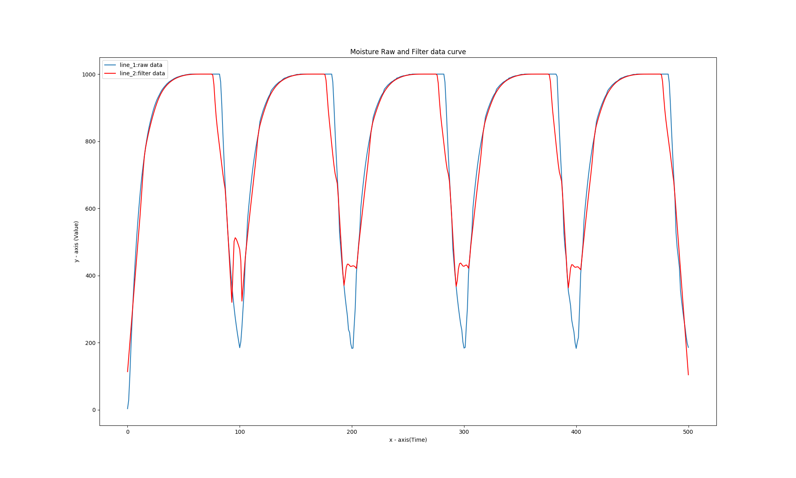
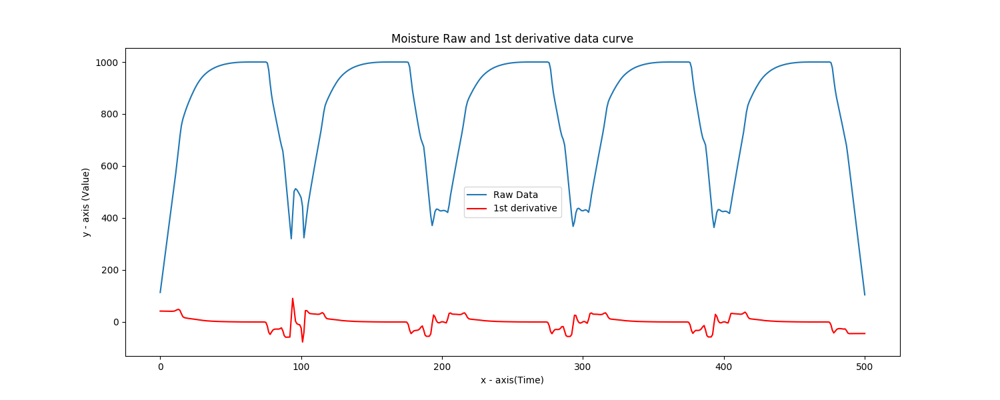
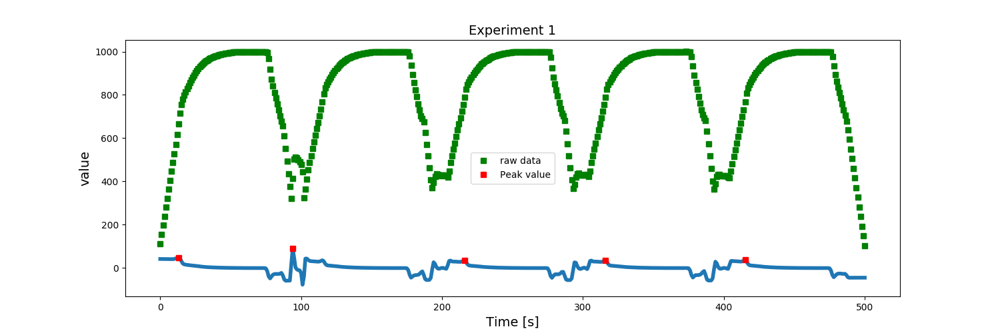
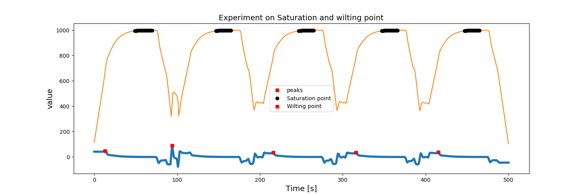
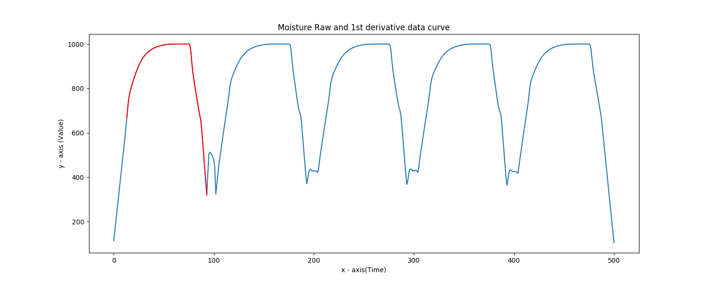
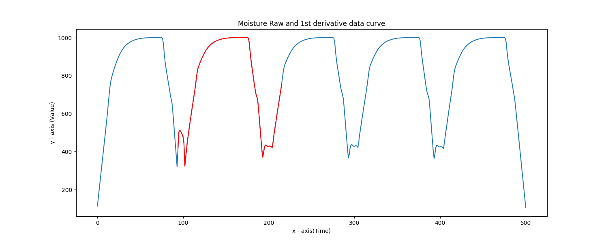
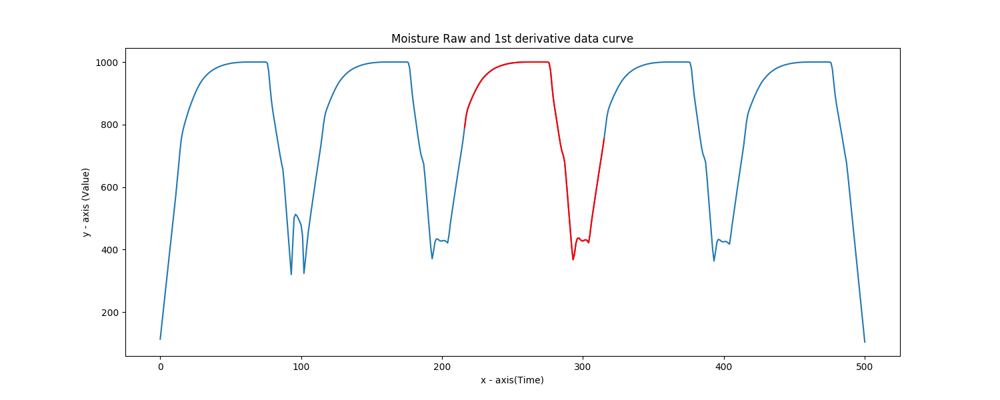
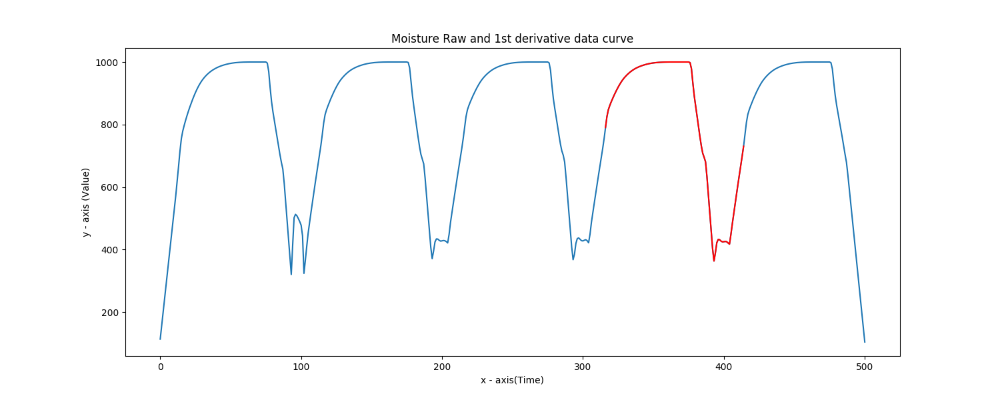

## Moisture Detection 

Moisture detection project menual


## File Structure

```
MOI_D_V1.0.0
    ├── logs
    ├── prediction.py
    └── utility
        ├── ampd.py
        ├── Derivativte_and_Pick_value.py
        └── NoiseAndOutlierRemoving.py
```
## Requirememt
Please have a look requirement file or  given below,

```
matplotlib==3.1.2
numpy==1.19.5
pandas==1.1.5
pycse==2.0.4
scipy==1.5.4
```

## Testing

please make sure all requirement and run ```predict.py``` script. and also make sure input data path directory.

__N.B__: please check log directory all output save here.


### Raw data Figure


### Noise and Outlier removing Figure


### Derivaive



### Peak Value Detection


### Saturation and wilting prediction



### Cycle Isolation

 
 
 
 


## Next Operation
Upcomming

# Contributor
Tau - TECH_TEAM


